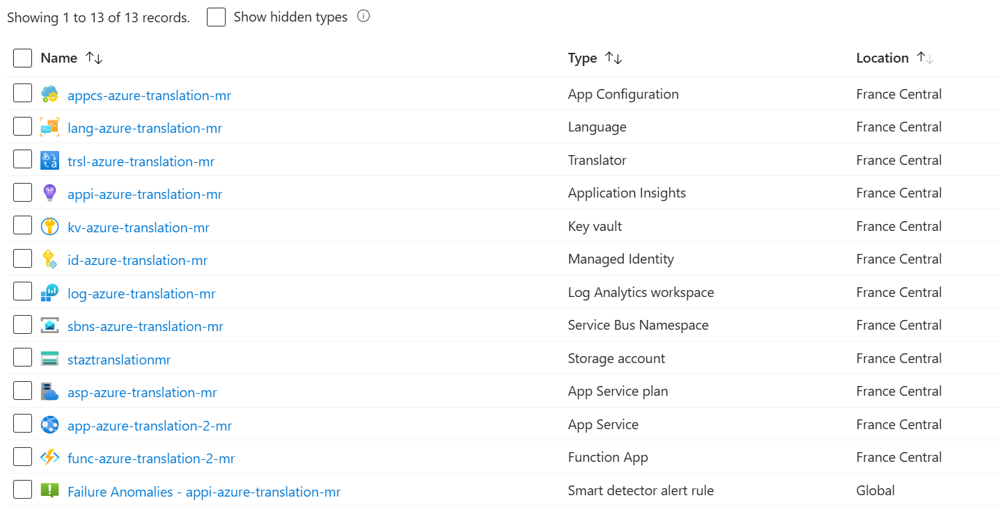

# Azure Translation Demo

This repository contains a .NET Core–based solution for managing asynchronous text translations using various Azure services. The system exposes an HTTP REST API to accept text for translation and returns a request identifier to track the process. An Azure Function performs the translation asynchronously, detecting the input language when needed and translating the text to Spanish.  

You can query the status and result of the translation by providing the request identifier returned in the initial call.  



> *This image shows the resources created by Terraform in Azure (Key Vault, App Configuration, Service Bus, Table Storage, and more).*

---

## High-Level Architecture

1. **ASP.NET Core API (AzureTranslation.Api)**  
   - Receives translation requests and returns a unique request identifier.  
   - Manages status queries for translation requests.

2. **Azure Function (AzureTranslation.Function)**  
   - Consumes messages from a Service Bus queue.  
   - Performs language detection and translation using Azure Cognitive Services.  
   - Stores results (along with the text’s language and translation) in Azure Table Storage.

3. **Azure Resources**  
   - **Service Bus** – Used for asynchronous communication between the API and the Function.  
   - **Table Storage** – Stores translation status and results.  
   - **Key Vault** – Safely holds secrets for authentication/authorization tokens.  
   - **App Configuration** – Centralizes configuration data.  
   - **(Additional Services)** – Other Azure resources (e.g., Log Analytics, Application Insights, Managed Identity, etc.) to support monitoring, security, and configuration.

4. **Local Development (Aspire)**  
   - The solution can be developed and tested locally using [Aspire](https://learn.microsoft.com/en-us/dotnet/aspire/get-started/aspire-overview) for a smoother setup experience.

---

## Folder Structure

```plaintext
AZURE-TRANSLATION-DEMO
├── doc
│   └── resource_group.png               // Azure resources diagram
├── infra
│   └── terraform
│       ├── backend                      // State backend configuration
│       ├── resources                    // Terraform modules and definitions
│       ├── main.tf
│       ├── outputs.tf
│       ├── providers.tf
│       ├── terraform.tfvars
│       └── variables.tf
├── postman
│   ├── Azure.postman_environment.json
│   ├── AzureTranslation.postman_collection.json
│   └── Local.postman_environment.json
├── src
│   ├── AzureTranslation.Api             // ASP.NET Core Web API
│   ├── AzureTranslation.AppHost         // Application bootstrap/hosting (Aspire)
│   ├── AzureTranslation.Common          // Common utilities
│   ├── AzureTranslation.Core            // Core application logic
│   ├── AzureTranslation.Function        // Azure Function for async translation
│   ├── AzureTranslation.Infrastructure  // Infrastructure abstractions
│   └── AzureTranslation.ServiceDefaults // Default service settings
├── AzureTranslation.sln
├── Directory.Build.props
├── Directory.Build.targets
├── global.json
├── NuGet.config
└── README.md                            // This file
```

---

## How It Works

1. **Submit Translation Request**  
   - Send an HTTP POST to the API endpoint (e.g., `/api/v1/translations`) with the text to translate.
   - The API returns a **request identifier** for the ongoing translation job.

2. **Background Processing**  
   - The Azure Function picks up the message from the Service Bus queue.
   - The function detects the source language (using Azure Cognitive Services).
   - If not already Spanish, it translates the text into Spanish.
   - The function saves the result in Azure Table Storage.

3. **Check Translation Result**  
   - Perform an HTTP GET to the API endpoint with the **request identifier** (e.g., `/api/v1/translations/{id}`).
   - The API retrieves the status and translation (if completed) from Table Storage.

---

## Prerequisites

- [.NET 9 or later](https://dotnet.microsoft.com/download)  
- [Azure CLI](https://docs.microsoft.com/cli/azure/install-azure-cli) and [Terraform CLI](https://www.terraform.io/downloads.html)  
- An Azure subscription and appropriate permissions for provisioning resources (if you plan to deploy).

---

## Testing with Postman

Inside the `postman` folder, you will find:

- **Postman Collection**  
  `AzureTranslation.postman_collection.json` – Contains endpoints for creating and retrieving translation requests.

- **Environment Files**  
  `Azure.postman_environment.json` and `Local.postman_environment.json` – Contain variables like URLs and resource keys. Select the appropriate environment for local or Azure testing.

> [!NOTE]  
> The solution is currently deployed in Azure and can be tested using the "Azure" environment in Postman.

**Endpoints:**

- **POST** → [https://app-azure-translation-2-mr.azurewebsites.net/api/v1/translations](https://app-azure-translation-2-mr.azurewebsites.net/api/v1/translations)
- **GET** → [https://app-azure-translation-2-mr.azurewebsites.net/api/v1/translations/{id}](https://app-azure-translation-2-mr.azurewebsites.net/api/v1/translations/{id})

